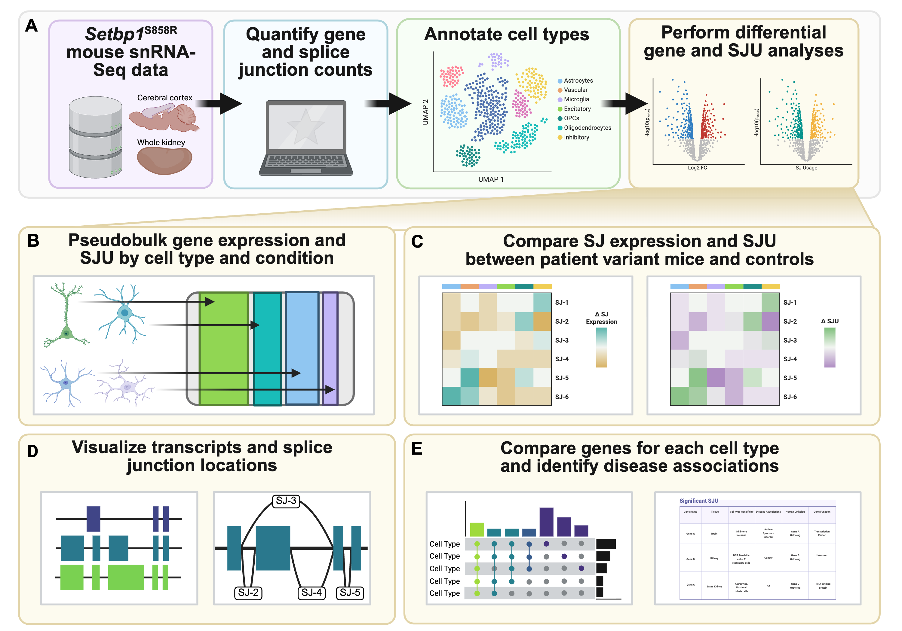

```{r setup, include=FALSE}
knitr::opts_chunk$set(echo = TRUE)
```
Publication:   
[](https://doi.org/10.1242/dmm.052402)  
Featured First Author Interview:    
[](https://doi.org/10.1242/dmm.052868)

## Authors 

**Tabea M. Soelter<sup>#</sup>, Emma F. Jones<sup>#</sup>, Timothy C. Howton, Anthony B. Crumley, Elizabeth J. Wilk,  Brittany N. Lasseigne*** 

\#Equal contribution  
*Corresponding author

## Project Overview 

Schinzel-Giedion syndrome (SGS) is an ultra-rare Mendelian disorder caused by gain-of-function variants in the *SETBP1* gene. Although previous studies determined multiple roles for *SETBP1* and its associated pathways in disease manifestation, they did not assess whether cell-type-specific alternative splicing (AS) plays a role in SGS. We quantified gene and splice junction expression from single-nuclei RNA-sequencing data from the cerebral cortex and the kidney of atypical <i>Setbp1</i><sup>S858R</sup> SGS patient variant and wild-type mice. We identified 33 and 62 genes with statistically significant alterations in splice junction usage in the brain and the kidney, respectively. We identified significant splice junction usage in a member of the heterogeneous nuclear ribonucleoprotein family, *Hnrnpa2b1.* These findings were cell-type-specific in the cerebral cortex and cell-type-agnostic in the kidney, suggesting tissue-specificity of AS in <i>Setbp1</i><sup>S858R</sup> mice. To broaden the impact of our results for the rare disease community, we developed a point-and-click web application that enables users to explore single-cell-resolution changes at the gene and splice junction levels. Overall, our findings implicate AS in a tissue- and cell-type-specific manner in the cerebral cortex and kidney of <i>Setbp1</i><sup>S858R</sup> mice.



## Scripts 

```{r echo = FALSE}
fs::dir_tree("src", recurse = TRUE, regexp = "*.err|*.out", invert = TRUE)
```

## Lasseigne Lab 

[What is Happening in the Lasseigne Lab?](https://www.lasseigne.org/)

<!-- markdownlint-disable-next-line MD013 -->


## Funding 

This work was funded by the UAB Lasseigne Lab funds and the UAB Pilot Center for Precision Animal Modeling (C-PAM) (1U54OD030167).

## Acknowledgements 

We would like to acknowledge all current and former members of the Lasseigne Lab for their thoughtful feedback, especially Amanda D. Clark and Vishal H. Oza. The graphical abstract was created using BioRender.

## License 

This repository is licensed under the MIT License, see LICENSE documentation within this repository for more details.
